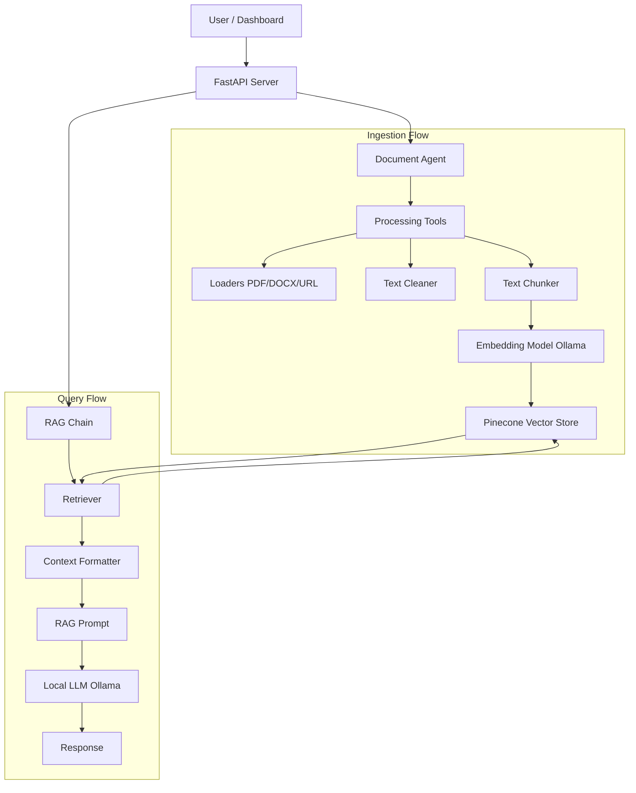

# 🤖 Local RAG Chatbot Pipeline

A robust, modular Retrieval-Augmented Generation (RAG) system built with **FastAPI**, **Streamlit**, **LangChain**, and **Pinecone**. It leverages local LLMs via **Ollama** for both embeddings and inference, ensuring privacy and control.

---

## 🏗️ Architecture

The system follows a modular "Agentic" design pattern, separating concerns into distinct layers:



### Core Components
- **API (`api.py`)**: RESTful entry point for the application.
- **Dashboard (`dashboard.py`)**: Streamlit-based UI for chatting and uploading files.
- **Document Agent (`agents/document_agent.py`)**: Orchestrates file ingestion.
- **Tools (`tools/process_document.py`)**: Handles loading, cleaning, and chunking documents.
- **Retriever (`chains/retriever.py`)**: Efficiently fetches relevant context using Cosine Similarity.
- **RAG Chain (`chains/rag_chain.py`)**: Combines retrieval and generation into a seamless response.

---

## 🚀 Features

*   **Multi-Format Ingestion**: Supports PDF, DOCX, and URLs.
*   **Smart Metadata**: Automatically extracts and preserves filenames and timestamps.
*   **High-Performance Retrieval**: Uses optimized Cosine Similarity search with Pinecone.
*   **Local AI Power**:
    *   **Embeddings**: `embeddinggemma:latest` (via Ollama)
    *   **LLM**: `kimi-k2-thinking:cloud` (via Ollama)
*   **Clean UI**: Chat history sidebar and intuitive upload controls.

---


## 📦 Installation

1.  **Clone the repository**:
    ```bash
    git clone <repository-url>
    cd rag_with_clip
    ```

2.  **Create a virtual environment**:
    ```bash
    python -m venv .venv
    source .venv/bin/activate 
    ```

3.  **Install dependencies**:
    ```bash
    pip install -r requirements.txt
    ```

4.  **Configure Environment**:
    Create a `.env` file in the root directory:
    ```env
    PINECONE_API_KEY=your_pinecone_api_key
    PINECONE_INDEX_NAME=your_index_name
    ```

---

## 🏃‍♂️ Usage

### 1. Start the API Server
The backend handles all logic. Run it first:
```bash
uvicorn api:app --reload
```
*Server running at: `http://localhost:8000`*

### 2. Start the Dashboard
Open a new terminal and run the UI:
```bash
streamlit run dashboard.py
```
*Dashboard accessible at: `http://localhost:8501`*

---

## 📂 Project Structure

```text
rag_with_clip/
├── agents/                 # High-level agents
│   └── document_agent.py   # Manages ingestion workflow
├── chains/                 # LangChain logic
│   ├── rag_chain.py        # Question-Answering pipeline
│   └── retriever.py        # Optimized retrieval logic
├── models/                 # Model wrappers
│   ├── embedding_model.py  # Ollama Embeddings wrapper
│   └── llm.py              # Ollama LLM wrapper
├── tools/                  # Low-level processing tools
│   ├── process_document.py # Main processing pipeline
│   ├── clean_text.py       # Text cleaning interface
│   └── utils/
│       ├── document_loaders.py # PDF/DOCX/URL loaders
│       ├── text_cleaner.py     # Cleaning logic
│       └── text_chunker.py     # Chunking logic
├── utils/                  # Shared utilities
│   └── vector_store.py     # Pinecone manager
├── api.py                  # FastAPI application
├── config.py               # Application settings
├── dashboard.py            # Streamlit UI
├── requirements.txt        # Dependencies
└── .env                    # Secrets (not committed)
```

---


## 📝 Configuration

Key settings can be adjusted in `config.py` or overridden via environment variables:

*   `RAG_TOP_K`: Number of documents to retrieve (default: 5)
*   `CHUNK_SIZE`: Size of text chunks (default: 1000)
*   `CHUNK_OVERLAP`: Overlap between chunks (default: 200)

