# 🔮 VRAG - Vision RAG Pipeline

A **multimodal Retrieval-Augmented Generation** system that understands both **text and images**. Built with CLIP for vision embeddings, LangChain for orchestration, Pinecone for vector storage, and Ollama for local LLM inference.

---

## 🏗️ Architecture

```mermaid
flowchart TB
    subgraph User Interface
        Dashboard["🖥️ Streamlit Dashboard"]
        API["⚡ FastAPI Server"]
    end
    
    Dashboard --> API
    
    subgraph Ingestion Pipeline
        direction TB
        Upload["📄 Upload\nPDF / DOCX / Image"]
        Extract["📝 Extract Text + Images\nPyMuPDF + RapidOCR"]
        Chunk["✂️ Chunk Text\nRecursiveCharacterTextSplitter"]
        
        subgraph Embeddings
            TextEmbed["🔤 Text Embedding\nembeddinggemma (768-d)"]
            CLIPEmbed["🖼️ Image Embedding\nCLIP ViT-L/14 (768-d)"]
            CLIPLabel["🏷️ Zero-Shot Label\nCLIP Classification"]
        end
        
        Upload --> Extract
        Extract --> Chunk
        Extract --> CLIPEmbed
        Extract --> CLIPLabel
        Chunk --> TextEmbed
        
        TextEmbed --> VectorDB["🗄️ Pinecone\nUnified 768-d Index"]
        CLIPEmbed --> VectorDB
    end
    
    API --> Upload
    
    subgraph Query Pipeline
        direction TB
        Query["❓ User Query\nText / Image / Both"]
        
        subgraph Fusion
            QueryText["🔤 Text → embeddinggemma"]
            QueryImage["🖼️ Image → CLIP"]
            Fuse["⚗️ Normalize + Fuse\n(v_text + v_image) / 2"]
        end
        
        Query --> QueryText
        Query --> QueryImage
        QueryText --> Fuse
        QueryImage --> Fuse
        
        Fuse --> Search["🔍 Vector Search\nCosine Similarity"]
        Search --> VectorDB
        VectorDB --> Context["📋 Context Builder\nText + Image Metadata"]
        Context --> Prompt["📝 VRAG Prompt\nMultimodal Instructions"]
        Prompt --> LLM["🤖 Local LLM\nOllama"]
        LLM --> Response["💬 Answer + Sources"]
    end
    
    API --> Query
    Response --> API
```



---

## ✨ Key Features

| Feature | Description |
|---------|-------------|
| **🖼️ Vision Understanding** | CLIP embeds images into the same 768-d space as text |
| **🏷️ Zero-Shot Classification** | Automatically labels images (chart, diagram, table, etc.) |
| **⚗️ Multimodal Fusion** | Query with text, image, or both - vectors are normalized and fused |
| **📄 PDF + OCR** | Extracts text and images from PDFs using PyMuPDF + RapidOCR |
| **🔒 Local AI** | Uses Ollama for embeddings and LLM - no data leaves your machine |
| **🎯 Unified Index** | Single Pinecone index stores both text and image vectors |

---

## 🛠️ Tech Stack

| Component | Technology |
|-----------|------------|
| **Text Embeddings** | `embeddinggemma:latest` via Ollama (768-d) |
| **Image Embeddings** | `openai/clip-vit-large-patch14` (768-d) |
| **LLM** | Ollama (configurable model) |
| **Vector Database** | Pinecone |
| **Backend** | FastAPI |
| **Frontend** | Streamlit |
| **Document Parsing** | PyMuPDFLoader + RapidOCR |

---

## 📦 Installation

```bash
# Clone and enter directory
git clone <repository-url>
cd rag_with_clip

# Create virtual environment
python -m venv .venv
source .venv/bin/activate

# Install dependencies
pip install -r requirements.txt

# Configure environment
cat > .env << EOF
PINECONE_API_KEY=your_pinecone_api_key
PINECONE_INDEX_NAME=your_index_name
EOF
```

### Prerequisites
- Python 3.10+
- [Ollama](https://ollama.ai) installed with `embeddinggemma` model
- Pinecone account with a **768-dimension** index

---

## 🚀 Usage

### Start the Services

```bash
# Terminal 1: API Server
uvicorn api:app --reload

# Terminal 2: Dashboard
streamlit run dashboard.py
```

- **API**: http://localhost:8000
- **Dashboard**: http://localhost:8501
- **API Docs**: http://localhost:8000/docs

### API Endpoints

| Endpoint | Method | Description |
|----------|--------|-------------|
| `/upload` | POST | Ingest PDF/DOCX (text + images) |
| `/upload-image` | POST | Ingest standalone image |
| `/chat` | POST | Multimodal query (text, image, or both) |

### Query Modes

The dashboard supports three query modes:

1. **📝 Text Only**: Traditional text-based retrieval
2. **🖼️ Image Only**: Find similar images using CLIP
3. **📝+🖼️ Text + Image**: Fused multimodal search

---

## 📂 Project Structure

```
rag_with_clip/
├── agents/
│   └── document_agent.py    # Orchestrates file ingestion
├── chains/
│   ├── rag_chain.py         # Query → Retrieve → Generate
│   └── retriever.py         # Multimodal vector search
├── models/
│   ├── clip_model.py        # CLIP wrapper (embed + label)
│   ├── embedding_model.py   # Ollama text embeddings
│   └── llm.py               # Ollama LLM wrapper
├── prompts/
│   └── rag_prompts.py       # VRAG system prompt
├── tools/
│   ├── process_document.py  # Processing pipeline
│   ├── load_documents.py    # Document loader interface
│   └── utils/
│       ├── document_loaders.py  # PDF/DOCX loaders
│       ├── text_cleaner.py      # Text normalization
│       └── text_chunker.py      # Recursive chunking
├── utils/
│   └── vector_store.py      # Pinecone + multimodal search
├── api.py                   # FastAPI application
├── dashboard.py             # Streamlit UI
├── config.py                # Settings
└── requirements.txt
```

---

## ⚙️ Configuration

Edit `config.py` or set environment variables:

| Setting | Default | Description |
|---------|---------|-------------|
| `RAG_TOP_K` | 5 | Documents to retrieve |
| `CHUNK_SIZE` | 1000 | Text chunk size |
| `CHUNK_OVERLAP` | 200 | Overlap between chunks |
| `EMBEDDING_MODEL_NAME` | embeddinggemma:latest | Ollama embedding model |

---

## 🔄 How It Works

### Ingestion Flow
1. **Upload** PDF/DOCX/Image via API or dashboard
2. **Extract** text (with OCR) and images from documents
3. **Embed** text chunks with `embeddinggemma` (768-d)
4. **Embed** images with CLIP (768-d) + generate zero-shot labels
5. **Store** all vectors in unified Pinecone index

### Query Flow
1. **Receive** query (text, image, or both)
2. **Embed** text with `embeddinggemma`, image with CLIP
3. **Fuse** embeddings: `normalize((v_text + v_image) / 2)`
4. **Search** Pinecone for similar vectors
5. **Build** context from retrieved text + image metadata
6. **Generate** answer using local LLM with VRAG prompt
7. **Return** answer with source citations

---

## 📝 License

MIT License - See LICENSE file for details.
